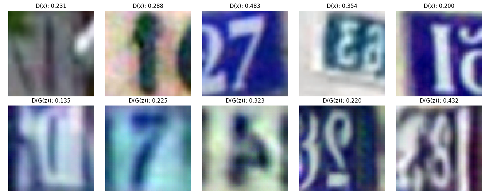
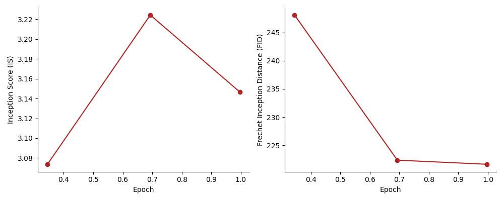

# GAN Evaluator for Inception Score (IS) and Frechet Inception Distance (FID) in PyTorch

Chen Liu (chen.liu.cl2482@yale.edu), Alex Wong (alex.wong@yale.edu)

*Please kindly :star2:[](https://github.com/ChenLiu-1996/GAN-IS-FID-evaluator/):star2: this repo for better reach if you find it useful. Let's help out the community!*

## NEWS
- [Feb 18, 2022] Now available on PyPI! Now you can install it directly to your desired environment via:
    ```
    python -m pip install gan-evaluator
    ```
    And in your Python project, wherever you need the `GAN_Evaluator`, you can import via:
    ```
    from gan_evaluator import GAN_Evaluator
    ```
    NOTE: **You no longer need to copy any code from this repo in order to use `GAN_Evalutor`**! At this point, the primary purpose of this repo is a description/demonstration. With that said, you surely can clone this repo and try out the demo script.
    NOTE: During `pip install gan-evaluator`, the dependencies of `GAN_Evaluator` (but not of the demo script) are also installed.

## Main Contributions
1. We created a GAN evaluator for IS and FID that
    - [is easy to use](#usage),
    - accepts data as either dataloaders or individual batches, and
    - supports on-the-fly evaluation during training.
2. We provided a simple demo script to demonstrate one common use case.

## Demo Script: Use [DCGAN](https://pytorch.org/tutorials/beginner/dcgan_faces_tutorial) to generate [SVHN](http://ufldl.stanford.edu/housenumbers/) digits

The script can be found in [`src/train_dcgan_svhn.py`](https://github.com/ChenLiu-1996/GAN-IS-FID-evaluator/blob/main/src/train_dcgan_svhn.py)

- Usage from the demo script, to give you a taste.

    <details>
    <summary><b>Declaration</b></summary>

    ```
    evaluator = GAN_Evaluator(device=device,
                              num_images_real=len(train_loader.dataset),
                              num_images_fake=len(train_loader.dataset))
    ```
    </details>

    <details>
    <summary><b>Before traing loop</b></summary>

    ```
    evaluator.load_all_real_imgs(real_loader=train_loader, idx_in_loader=0)
    ```
    </details>

    <details>
    <summary><b>Inside traing loop</b></summary>

    ```
    if shall_plot:
        IS_mean, IS_std, FID = evaluator.fill_fake_img_batch(fake_batch=x_fake)
    else:
        evaluator.fill_fake_img_batch(fake_batch=x_fake, return_results=False)
    ```
    </details>

    <details>
    <summary><b>After each epoch of training</b></summary>

    ```
    evaluator.clear_fake_imgs()
    ```
    </details>

- Some visualizations of the demo script:
    - Real (top) and Generated (bottom) images.
    

    - IS and FID curves.
    

## Details: The Evaluator for IS and FID
<details>
  <summary><b>Introduction to the Evaluator</b></summary>
<br>

More details can be found in [`src/utils/gan_evaluator.py/GAN_Evaluator`](https://github.com/ChenLiu-1996/GAN-IS-FID-evaluator/blob/main/src/utils/gan_evaluator.py#L13).

```
This evaluator computes the following metrics:
    - Inception Score (IS)
    - Frechet Inception Distance (FID)

This evaluator will take in the real images and the fake/generated images.
Then it will compute the activations from the real and fake images as well as the
predictions from the fake images.
The (fake) predictions will be used to compute IS, while
the (real, fake) activations will be used to compute FID.
If input image resolution < 75 x 75, we will upsample the image to accommodate Inception v3.

The real and fake images can be provided to this evaluator in either of the following formats:
1. dataloader
    `load_all_real_imgs`
    `load_all_fake_imgs`
2. per-batch
    `fill_real_img_batch`
    `fill_fake_img_batch`

!!! Please note: the latest IS and FID will be returned upon completion of either of the following:
    `load_all_fake_imgs`
    `fill_fake_img_batch`
Return format:
    (IS mean, IS std, FID)
*So please make sure you load real images before the fake images.*

Common Use Cases:
1. For the purpose of on-the-fly evaluation during GAN training:
    We recommend pre-loading the real images using the dataloader format, and
    populate the fake images using the per-batch format as training goes on.
    - At the end of each epoch, you can clean the fake images using:
        `clear_fake_imgs`
    - In *unusual* cases where your real images change (such as in progressive growing GANs),
    you may want to clear the real images. You can do so via:
        `clear_real_imgs`
2. For the purpose of offline evaluation of a saved dataset:
    We recommend pre-loading the real images and fake images.
```

</details>

## Repository Hierarchy
```
GAN-IS-FID-evaluator
    ├── config
    |   └── `dcgan_svhn.yaml`
    ├── data (*)
    ├── debug_plot (*)
    ├── logs (*)
    └── src
        ├── utils
        |   ├── `gan_evaluator.py`: THIS CONTAINS OUR `GAN_Evaluator`.
        |   └── other utility files.
        └── `train_dcgan_svhn.py`: our demo script.
```
Folders marked with (*), if not exist, will be created automatically when you run [`train_dcgan_svhn.py`](https://github.com/ChenLiu-1996/GAN-IS-FID-evaluator/blob/main/src/train_dcgan_svhn.py).

## Usage
- To run our demo script, do the following after activating the proper environment.
```
git clone git@github.com:ChenLiu-1996/GAN-IS-FID-evaluator.git
cd src
python train_dcgan_svhn.py --config ../config/dcgan_svhn.yaml
```
- To integrate our evaluator into your existing project, you can simply copy [`src/utils/gan_evaluator.py`](https://github.com/ChenLiu-1996/GAN-IS-FID-evaluator/blob/main/src/utils/gan_evaluator.py) to an appropriate folder in your project, and import `GAN_Evaluator` to wherever you find necessary.

- We will add our citation bibtex, and we would appreciate if you reference our work in case this repository helps you in your research.

## Citation
To be added.

## Environement Setup
<details>
  <summary><b>Packages Needed</b></summary>
<br>

The `GAN_Evaluator` module itself only uses `numpy`, `scipy`, `torch`, `torchvision`, and (for aesthetics) `tqdm`.

To run the example script, it additionally requires `matplotlib`, `argparse`, and `yaml`.

</details>

<details>
  <summary><b>On our Yale Vision Lab server</b></summary>

- There is a virtualenv ready to use, located at
`/media/home/chliu/.virtualenv/mondi-image-gen/`.

- Alternatively, you can start from an existing environment "torch191-py38env",
and install the following packages:
```
python3 -m pip install torch==1.12.1+cu113 torchvision==0.13.1+cu113 torchaudio==0.12.1 --extra-index-url https://download.pytorch.org/whl/cu113
python3 -m pip install wget gdown numpy matplotlib pyyaml click scipy yacs scikit-learn
```

If you see error messages such as `Failed to build CUDA kernels for bias_act.`, you can fix it with:
```
python3 -m pip install ninja
```

</details>

## Acknowledgements
1. The code for the `GAN_Evaluator` (specifically, the computation of IS and FID) is inspired by:
    - https://github.com/sbarratt/inception-score-pytorch/blob/master/inception_score.py
    - https://www.kaggle.com/code/ibtesama/gan-in-pytorch-with-fid
    - https://github.com/mseitzer/pytorch-fid/blob/master/src/pytorch_fid/fid_score.py
    - **Note: We did not validate the "mathmetical correctness" in their computations. Please use mindfully.**
2. The code for the demo script (specifically, architecture and training of DCGAN) is inspired by:
    - https://pytorch.org/tutorials/beginner/dcgan_faces_tutorial
